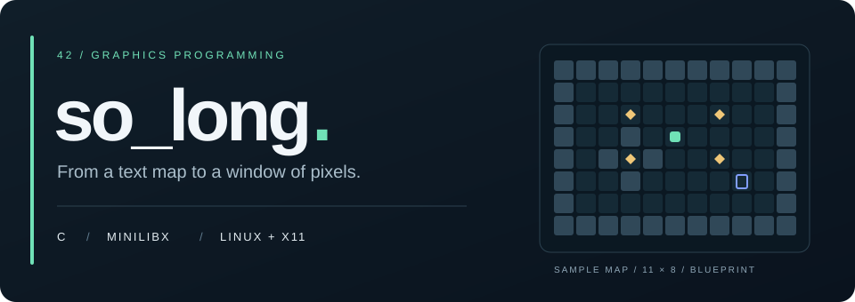

<p align="center">
  
</p>

<p align="center">
  <strong>A small map. A first step into graphics programming.</strong><br>
  A 42 project exploring C, MiniLibX, X11 events and tile-based rendering.
</p>

<p align="center">
  
  
  
  
</p>

<p align="center">
  <a href="#overview">Overview</a> ·
  <a href="#getting-started">Getting started</a> ·
  <a href="#map-format">Map format</a> ·
  <a href="#project-structure">Project structure</a> ·
  <a href="#development-status">Development status</a>
</p>

## Overview

**so_long** is a learning project built around a simple 2D game: navigate a map, collect every item and reach the exit. The implementation uses **C** and **MiniLibX**, with a bundled `libft` for string handling, memory utilities, formatted output and line-by-line file reading.

The current version focuses on loading `.ber` maps, opening an X11 window and drawing XPM sprites on a **32 × 32 pixel grid**. Movement and the complete gameplay loop are still under development.

### Engineering focus

| Area | Work represented in the code |
| --- | --- |
| File parsing | Read a map with `get_next_line` and build a two-dimensional character grid. |
| Graphics | Load XPM textures and translate map coordinates into window coordinates. |
| Event handling | Register keyboard and window-close callbacks through MiniLibX. |
| Program structure | Separate map loading, window setup, image loading, drawing and input handling. |
| Resource management | Work with dynamic memory, file descriptors and graphics resources; cleanup still needs refinement. |

## Getting started

### Requirements

- Linux with an accessible **X11 display**.
- A C compiler and `make`.
- X11, Xext and BSD development libraries for the bundled MiniLibX.

On Ubuntu / Debian:

```bash
sudo apt-get update
sudo apt-get install build-essential libx11-dev libxext-dev libbsd-dev
```

The repository includes `libft` and the Linux version of MiniLibX. For additional graphics requirements, see the [bundled MiniLibX documentation](mlx/README.md).

### Build and launch

```bash
git clone https://github.com/PSGui/42-So_Long.git
cd 42-So_Long
make
./so_long maps_example/teste.ber
```

Run the executable **from the repository root**, because sprite paths are relative to that directory. The expected invocation takes exactly one map file ending in `.ber`.

> This is a development version. Launching is intended to display the map; it does not yet provide a playable collect-and-exit game. A graphical X11 session is required, including when using WSL or a remote Linux machine.

### Make targets

| Command | Purpose |
| --- | --- |
| `make` | Build the bundled libraries and the `so_long` executable. |
| `make clean` | Remove the game's object files. |
| `make fclean` | Also remove the executable and clean `libft`. |
| `make re` | Rebuild the project. |
| `make leak` | Rebuild and launch the sample map under Valgrind; requires Valgrind and X11. |

## Controls

| Input | Current behavior |
| --- | --- |
| `W` / `A` / `S` / `D` | Mapped to directional callbacks; movement is not implemented yet. |
| `Esc` | Calls the shutdown handler. |
| Window close button | Calls the close callback; its cleanup still needs correction. |

## Map format

Maps are text files with the `.ber` extension. Each character corresponds to one tile:

| Symbol | Tile |
| :---: | --- |
| `1` | Wall |
| `0` | Floor |
| `P` | Player starting position |
| `C` | Collectible |
| `E` | Exit |

The included [sample map](maps_example/teste.ber) is **11 columns × 8 rows**:

```text
11111111111
10000000001
100C000C001
10010P00001
101C100C001
10010000E01
10000000001
11111111111
```

For the intended game, maps should have equal-length rows, a closed wall boundary, one player, one exit and at least one collectible, with a route to every collectible and the exit. **The current validation does not yet enforce all of these rules reliably.** The header illustration is a schematic of this sample map, not a gameplay screenshot.

## Project structure

| Location | Responsibility |
| --- | --- |
| [`source/so_long.c`](source/so_long.c) | Entry point, argument checks and startup sequence. |
| [`source/`](source/) | Numbered modules for parsing, graphics, map checks and input, plus shutdown handlers. |
| [`includes/`](includes/) | Shared structures, constants and function declarations. |
| [`game_assets/`](game_assets/) | XPM sprites for the player, floor, walls, collectibles and exit. |
| [`maps_example/`](maps_example/) | Sample `.ber` map. |
| [`libft/`](libft/) | Bundled C utility library. |
| [`mlx/`](mlx/) | Bundled MiniLibX for Linux / X11. |
| [`docs/`](docs/) | Repository presentation assets. |

## Development status

This repository captures a **work in progress**, rather than a completed game.

- [x] Map-file loading and a two-dimensional grid representation.
- [x] X11 window setup and XPM tile-rendering code.
- [x] Keyboard and window-event callback registration.
- [ ] Player movement and wall collisions.
- [ ] Collectible tracking, move counting and exit conditions.
- [ ] Reliable map shape, boundary and object-count validation.
- [ ] Reachability validation for collectibles and the exit.
- [ ] Consistent cleanup and error handling on every exit path.

<details>
<summary>Implementation notes</summary>

The movement functions are currently placeholders. Object counting and map checks need correction, and some shutdown paths attempt to free a stack-allocated game structure. These are the next implementation tasks before treating the project as playable.

</details>

---

<p align="center">
  <a href="https://github.com/PSGui">PSGui</a> · 42 programming project · C / MiniLibX
</p>
